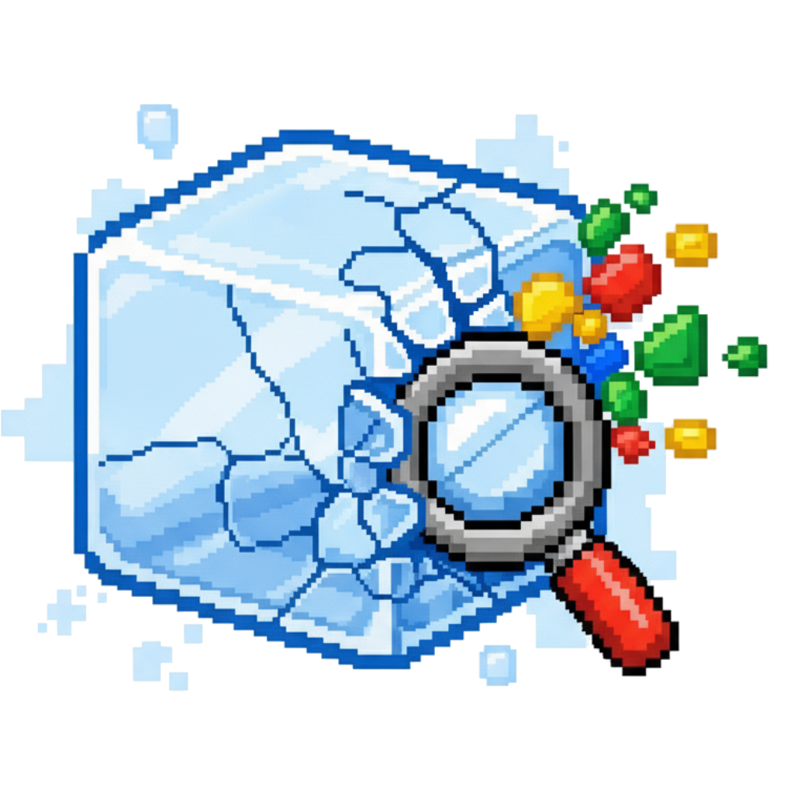

# 🎨 Chromatic - Ice Googleyness Breaker

<div align="center">



**An interactive two-player ice-breaking game**

[](https://opensource.org/licenses/MIT)
[](https://reactjs.org/)
[](https://www.typescriptlang.org/)
[](https://vitejs.dev/)
[](https://tailwindcss.com/)

[🎮 Play Now](https://chromatic.gdgdavao.org) • [📖 Documentation](#documentation)

</div>

## 🌟 About

**Chromatic** is an engaging two-player ice-breaking game designed to help developers connect and have fun at GDG Davao events. The game combines strategy, luck, and quick thinking in a colorful, interactive experience.

### 🎯 How It Works

1. **Rock Paper Scissors** - Two players battle for control
2. **Spin the Wheel** - Winner spins the colorful wheel to determine question category
3. **Answer Fast** - 90 seconds to answer a color-coded question
4. **Connect & Share** - Break the ice and build community

### 🎨 Features

- **Interactive Gameplay**: Rock Paper Scissors with animated hand gestures
- **Colorful Wheel**: GSAP-powered spinning wheel with Google's brand colors
- **Dynamic Questions**: Google-themed questions across 4 color categories
- **Smooth Animations**: Fluid transitions and engaging visual effects
- **Responsive Design**: Works perfectly on desktop and mobile devices
- **Accessibility**: Built with accessibility in mind

## 🚀 Quick Start

### Prerequisites

- **Node.js** 18+ or **Bun** 1.0+

### Installation

```bash
# Clone the repository
git clone https://github.com/gdgdavao/chromatic.git
cd chromatic

# Install dependencies (using Bun - recommended)
bun install

# Or using npm
npm install

# Or using yarn
yarn install
```

### Development

```bash
# Start development server
bun dev

# Or using npm
npm run dev

# Or using yarn
yarn dev
```

Open [http://localhost:5173](http://localhost:5173) to view it in the browser.

### Building for Production

```bash
# Build for production
bun run build

# Or using npm
npm run build

# Or using yarn
yarn build
```

The build artifacts will be stored in the `dist/` directory.

## 🛠️ Tech Stack

- **Frontend Framework**: React 19.1.1 with TypeScript
- **Build Tool**: Vite 7.1.2
- **Styling**: Tailwind CSS 4.1.13
- **Animations**: GSAP 3.13.0 with React integration
- **Package Manager**: Bun (recommended) / npm / yarn
- **Deployment**: Static hosting (Vercel, Netlify, etc.)

## 📁 Project Structure

```
chromatic/
├── public/
│   ├── favicon.svg          # App icon
│   └── icon.svg            # Social media image
├── src/
│   ├── components/
│   │   ├── ChromaticGame.tsx    # Main game component
│   │   └── Onboarding.tsx       # Welcome/tutorial screens
│   ├── assets/
│   │   └── icon.svg            # Game icon
│   ├── App.tsx                 # Root component
│   ├── main.tsx               # Entry point
│   └── index.css              # Global styles
├── index.html                # HTML template with social meta tags
├── package.json              # Dependencies and scripts
├── vite.config.ts           # Vite configuration
├── tsconfig.json            # TypeScript configuration
└── README.md               # This file
```

## 🎮 Game Components

### ChromaticGame
The main game component featuring:
- Rock Paper Scissors logic with automated gameplay
- GSAP-powered spinning wheel with precise landing mechanics
- Question system with Google-themed content
- Timer and scoring system
- Smooth animations and visual effects

### Onboarding
Interactive tutorial screens including:
- Welcome screen with animated logo
- Step-by-step game explanation
- Smooth transitions between screens
- Accessibility considerations

## 🎨 Design System

### Colors
The game uses Google's brand colors:
- **Red**: `#ea4335` - Google Red
- **Green**: `#34a853` - Google Green  
- **Blue**: `#4285f4` - Google Blue
- **Yellow**: `#fbbc05` - Google Yellow

### Typography
- **Primary Font**: Roboto (Google Fonts)
- **Weights**: 400 (Regular), 500 (Medium), 700 (Bold)

### Animations
- **GSAP**: For complex animations and transitions
- **CSS Transitions**: For hover states and micro-interactions
- **Reduced Motion**: Respects user preferences

## 🤝 Contributing

We welcome contributions from the community! Here's how you can help:

### 🐛 Bug Reports
- Use the [GitHub Issues](https://github.com/gdgdavao/chromatic/issues) page
- Include steps to reproduce, expected vs actual behavior
- Provide browser/device information

### 💡 Feature Requests
- Open an issue with the "enhancement" label
- Describe the feature and its benefits
- Consider implementation complexity

### 🔧 Code Contributions

1. **Fork the repository**
2. **Create a feature branch**
   ```bash
   git checkout -b feature/amazing-feature
   ```
3. **Make your changes**
   - Follow the existing code style
   - Add TypeScript types where needed
   - Test your changes thoroughly
4. **Commit your changes**
   ```bash
   git commit -m 'Add amazing feature'
   ```
5. **Push to your branch**
   ```bash
   git push origin feature/amazing-feature
   ```
6. **Open a Pull Request**

### 📝 Development Guidelines

- **Code Style**: Follow existing patterns and use Prettier
- **TypeScript**: Add proper types for all new code
- **Testing**: Test on multiple devices and browsers
- **Accessibility**: Ensure keyboard navigation and screen reader support
- **Performance**: Keep animations smooth and optimize for mobile

### 🎯 Areas for Contribution

- **New Question Categories**: Add more Google-themed questions
- **Game Modes**: Implement different gameplay variations
- **Accessibility**: Improve screen reader support
- **Internationalization**: Add multi-language support
- **Performance**: Optimize animations and bundle size
- **Documentation**: Improve code comments and guides

## 📄 License

This project is licensed under the MIT License - see the [LICENSE](LICENSE) file for details.


---

<div align="center">

**Made with ❤️ by [GDG Davao](https://gdgdavao.org)**

</div>